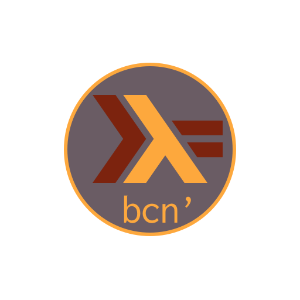

---

<div style='text-align: center;'>
  
  <p style='font-size: 72px;'>Haskell Barcelona</p>
  <p style='font-size: 42px;'>12th April 2016 @ <a href='http://itnig.net/es'>Itnig</a></p>
</div>

# Summary

* Introduction / Presentation
    * Who, What, How & When
    * History of Haskell
* Pure functional programming
    * Related concepts
    * Pros & Cons
    * Different approaches
    * Why Haskell?
* A brief introduction to Haskell
* Getting started with Haskell
* Haskell Tools
    * Building/project tools
    * Other

# Who & What

* Organizers
    * Antoni Silvestre, Software Engineer @ TID
    * Dani Pous, Software Engineer @ TID
    * Jordi Aranda, Data Engineer @ BBVA D&A
* Main goals
    * To learn & share:
        * Haskell & "relatives"
        * Pure functional programming
        * Category Theory
    * Meet people around with common interests
    * Open community: share your ideas and expectations

# How & When

* Talks
* Katas
* Discussions (libraries, papers, etc.)
    * Any proposal !?
* ~ Monthly meetings
* Recorded sessions (with slides/code samples available)

# History of Haskell

* Based on Lambda Calculus
* Started ~20 years ago
* Statically typed

# Pure functional programming

From Wikipedia:

> In computer science, <b>functional programming</b> is a programming paradigm
<br> that treats computation as the <b>evaluation</b> of mathematical <b>functions</b>
<br> and avoids <b>changing-state</b> and <b>mutable data</b>. (...) ($\to$ <b>functional</b>)

> It is a <b>declarative</b> (the what) programming paradigm, which means
<br> programming is done with <b>expressions</b> or <b>declarations</b>
<br> instead of <b>statements</b> (the how). (...)

> In functional code, the <b>output value</b> of a function <b>depends only</b>
<br> on the arguments that are <b>input</b> to the function, so calling a
<br> function $f$ twice with the same value for an argument $x$ will produce
<br> the same result $f(x)$ each time. (...) ($\to$ <b>purity</b>)

# Related concepts

* Purity ($\to$ referential transparency):
    * Every function $f$ is a function in the mathematical sense:
        * Every *input* has its corresponding *output*
        * Same *input* produces same *output*, **always**
        * Order does not matter
        * Easy concurrency
* Laziness:
    * Nothing evaluates unless necessary
    * Inner-most expressions first (**call by name**)
    * Allows:
        * Infinite data structures
        * Recursive types
        * Recursive functions
    * Category theory (**functor**, **monoid**, **monad**, and many other buzzwords)
* Reasoning ($\gets$ purity):

>"The central idea of pure functional programming is to structure
<br> our programs in such a way that we can reason about them as
<br> a system of equations just like we can in mathematics." **Stephen Diehl**

# Pros & Cons

* Advantages:
    * Maintainability
    * Testability
    * Increase of productivity
    * Code reuse, easier refactoring
    * Great levels of abstraction (**use carefully**)
    * Better reasoning
    * Developer Happiness

* Disadvantages:
    * For developers, steep learning curve
    * For companies, small pool of developers

# Different approaches

* Functional focuses on **what** and not **how**
* **Expressions** instead of **statements**
* Denotational semantics (code $\to$ mathematical expressions) instead of
<br> operational semantics (code $\to$ abstract machine statements)

# Why Haskell ? (I)

## if...

* Not much used, academia language
* Strange syntax
* Strange concepts (**Monads!?**)
* Steep learning curve
* Immutable

## because...

* We are very smart! (not really, definitely)
* We want to show off! (poor us...)
* We are dumb (and it helps to program **better**)

# Why Haskell ? (II)

> If Haskell is so great, why isn't it more popular?

<div style='text-align: center'>
  
</div>

# Why Haskell ? (III)

Actually it is a really **unfair analogy**:

* Coders solving nowadays increasingly difficult problems using "traditional"
<br> tools are the real heroes of the story
* Using Haskell is more about making your code live **more productive and enjoyable**
<br> and not the opposite
* Problems of traditional approaches:
    * Concurrency:
        * OOP encourages dangerous and buggy design
    * Side effects:
        * Don't scale, and **imperative programming** is all about side effects
        * The fact they are "hidden" makes them impossible to manage at the larger
* How does Haskell tackle this problems?
    * **Explicit side effects**, clear separation between *pure* and *impure* code
    * **Immutability**
    * **Functional patterns** $\to$ composability
    * A very expressive **type system**

# A brief introduction to Haskell

* Expressions<br>
* Types<br>
* Functions<br>
* Infix operators<br>
* Bindings<br>
* Basic data types<br>
* Typeclasses<br>
* Functional patterns<br>

# Expressions

* Everything in Haskell is an *expression* or *declaration*
* Basic unit of a Haskell program
* Expressions may be:
    * Values
    * Combination of values
    * Functions applied to values
* An Expression can be composed of sub-expressions
* Expressions *evaluate* to a *result*
* The following are all expressions:
    ```haskell
    1
    1 + 1
    "Hello, world!"
    ```

# Types

* Every expression has a *type*
* Types are a way of categorizing values
* We have different types for:
    * Numbers (whether they are integers, fractional numbers, etc.)
    * Boolean values
    * Characters or strings
    * Lists
    * Many other ADTs
* We can inspect the type of an expression using the `:t` command in the `GHCi`
    ```haskell
    Prelude> :t True
    True :: Bool
    Prelude> :t "Haskell"
    "Haskell" :: [Char]
    ```
* We can define new data types using the `data` keyword. For instance:
    ```haskell
    data Booly = Falsy | Truthy
    Prelude> :t Falsy
    Falsy :: Booly
    ```

# Functions (I)

* A function is an expression that is applied to an argument (or parameter) and always returns a result
* They always evaluate to the same result when given the same values
* As in **lambda calculus**, all functions take one argument at a time and return only
<br> one result ($\to$ currying, partial application by default)
* When defining functions, capitalization matters: they always start with a lowercase letter.
<br> Variables also start lowercase
* Haskell compiles tail recursive functions to loops.

# Functions (II)

* To define a function or value in `GCHi`, you must use `let`:
    ```haskell
    Prelude> let double x = x * 2
    ```
* Functions also have a type! Functions are statically typed, provided or inferred by the Type System
    ```haskell
    :t double
    double :: Num a => a -> a
    ```
* Let's inspect this function:
    ```
    double x    =   x * 2
    [1]   [2]  [3]   [4]
    ```
    1. Name of the function we are defining
    2. Argument of our function ("head" of a lambda)
    3. The `=` is used to define (or **declare**) values and functions. This is not how we
    <br> define equality between two values in Haskell
    4. Function body
* Calling the function by name and introducing a value for the $x$ argument makes our
<br> function a **reducible** expression:
    ```haskell
    Prelude> double 2
    4
    ```
* We can define **lambdas** using anonymous function syntax:
    ```haskell
    Prelude> (\x -> x) 0
    0
    ```

# Infix operators

* Default is **prefix syntax**, meaning that the function being applied is at the beginning
<br> of the expression rather than in the middle
* Not all functions are prefix though, e.g. arithmetic operators
* All operators are functions, not all functions are operators
    ```haskell
    Prelude> 1 + 1
    2
    Prelude> (+) 1 1
    2
    ```
* As in math, there is a default associativty and precedence for infix operators. We can ask
<br> `GHCi` for information such as this by using the `:i` command:
    ```haskell
    Prelude> :i (+)
    class Num a where
      (+) :: a -> a -> a
      ...
          -- Defined in ‘GHC.Num’
    infixl 6 +
    Prelude> :i (*)
    class Num a where
      ...
      (*) :: a -> a -> a
       ...
          -- Defined in ‘GHC.Num’
    infixl 7 *
    ```

# Bindings

* Use `=` to define a variable or function
* Bound names (variable, function, etc.) are:
    * **Immutable**: only one binding for symbol and scope
    * **Order independent**: order of bindings does not matter in source code
    * **Lazy**: bindings are only evaluated when necessary
    * **Recursive**: the bound symbol is in the scope of its own definition

# Basic types

* Boolean:
    ```haskell
    data Bool = False | True
    ```
* Numeric:
    * `Integral` numbers: whole numbers, positive and negative
        * `Int` (`Int8`, `Int16`, `Int32`, `Int64`): fixed precision integer (they have a range, with min/max values)
        * `Integer`: arbitrarily large (or small) numbers
    * `Fractional` numbers:
        * `Float`: single-precision floating point numbers
        * `Double`: double-precision floating point number
        * `Rational`: ratio of two `Integer`, the numerator and the denominator
        * `Scientific`: space efficient and almost-arbitrary precission scientific number.
        <br> They store the coefficient as an `Integer` and the exponent as an `Int`.
* Tuples (multiples values within a single value, values' types might be different):
    ```haskell
    data (,) a b = (,) a b
    Prelude> let x = (8 :: Int, 'h')
    Prelude> :t x
    x :: (Int, Char)
    ```
* () - a zero-tuple, pronounced unit (kind of void in C); there is only one value of this type, also written ()
* Functions (**first class citizens**):
    ```haskell
    :t (+)
    (+) :: Num a => a -> a -> a
    ```

# Data Types

* Data Types are Algebraic: are defined using combinations of OR and AND. These two operations form an algebra, with OR playing the role of addition and AND playing the role of multiplication. For example:
    * Lists (multiples values within a single value, values' types are equal):
    ```haskell
    data [] a = [] | a : [a]
    Prelude> let y = [1, 2, 3]
    Prelude> :t y
    x :: Num t => [t]
    ```

# Typeclasses (I)

A **typeclass** is some sort of interface which defines a behavior.

* `Eq`: implements equality
    ```haskell
    class Eq a where
      (==) :: a -> a -> Bool
      (/=) :: a -> a -> Bool
    ```
* `Num`: implemented by most numeric types
    ```haskell
    class Num a where
      (+) :: a -> a -> a
      (-) :: a -> a -> a
      (*) :: a -> a -> a
      negate :: a -> a
      abs :: a -> a
      signum :: a -> a
      fromInteger :: Integer -> a
    ```
* `Ord`: defines an order
    ```haskell
    class Eq a => Ord a where
      compare :: a -> a -> Ordering
      (<) :: a -> a -> Bool
      (<=) :: a -> a -> Bool
      (>) :: a -> a -> Bool
      (>=) :: a -> a -> Bool
      max :: a -> a -> a
      min :: a -> a -> a
    ```

# Typeclasses (II)

* `Enum`: for things enumerable, which have known predecessors and successors
    ```haskell
    class Enum a where
      succ :: a -> a
      pred :: a -> a
      toEnum :: Int -> a
      fromEnum :: a -> Int
      enumFrom :: a -> [a]
      enumFromThen :: a -> a -> [a]
      enumFromTo :: a -> a -> [a]
      enumFromThenTo :: a -> a -> a -> [a]
    ```
* `Show`: provides for the creating of human-readable string representations of
<br> structured data:
    ```haskell
    class Show a where
      showsPrec :: Int -> a -> ShowS
      show :: a -> String
      showList :: [a] -> ShowS
    ```

# Functional patterns

* Pattern matching<br>
* Case expressions<br>
* Higer-order functions<br>
* Guards<br>

# Pattern matching

Pattern matching is a way of matching values against patterns and, where appropriate
<br> binding them to successful matches ($\to$ deconstruction).

We can match over:

* Any value:
    ```haskell
    isItOne :: Integer -> Bool
    isItOne 1 = True
    isItOne _ = False
    ```
* Data constructors:
    ```haskell
    newtype Username = Username String
    data User = Guest | User Username
    printUser :: User -> IO ()
    printUser Guest = putStrLn "Guest"
    printUser (User (Username name)) = putStrLn $ "Registered user: " ++ name
    ```
* Pattern matching must be exhaustive, otherwise an error will pop up

# Case expressions vs Guards

## Case expressions

* Pretty similar to `if-then-else` expressions, of making a function
<br> return differently based on different inputs
* Can be used with any data type that has visible data constructors:
    ```haskell
    pal :: String -> String
    pal xs =
      case xs == reverse xs of
        True -> "yes"
        False -> "no"
    ```

## Guards

Guard syntax allows us to write compact functions that allow for two or more possible
<br> outcomes depending on the truth value of the conditions.

```haskell
myAbs :: Integer -> Integer
myAbs x
  | x < 0       = (-x)
  | otherwise   = x
```

# Higher-order functions

Functions that accept functions as arguments or return functions themselves.

```haskell
Prelude> :t map
map :: (a -> b) -> [a] -> [b]
Prelude> map (+1) [1,2,3]
[2,3,4]
```

# Getting started with Haskell

* Install [Haskell Platform](https://www.haskell.org/platform/)
* Create a file called `hello.hs` with the following contents:

```haskell
main = putStrLn "Hello, world!"
```

* Compile your program to a native executable like this:
```
  $ ghc --make hello
    [1 of 1] Compiling Main             ( hello.hs, hello.o )
    Linking hello ...
  $ ./hello
  Hello, world!
```

* Or run it in the `GHCi` like this:
```
$ ghci hello.hs
  GHCi, version 7.6.3: http://www.haskell.org/ghc/  :? for help
  ...
  Ok, modules loaded: Main.
  *Main> main
  Hello, world!
  *Main>
```

# Haskell tools (I)

Building/project tools

* [`stack`](http://docs.haskellstack.org/en/stable/README/): is a cross-platform program
<br> for developing Haskell projects. Allows independent environments with concrete compiler,
<br> libraries & tools. It's based on curated package sets called *snapshots*
* [`cabal`](https://www.haskell.org/cabal/): classical system for building and packaging
<br> Haskell libraries and programs
* [`ghc`](https://www.haskell.org/ghc/): the Glasgow Haskell Compiler
* Possible IDEs:
    * [Leksah](http://leksah.org)
    * [Haskell for Mac](http://haskellformac.com)
* Plugins available for text editors:
    * vi(m) / neovim
    * emacs / spacemacs
    * sublime
    * atom
* Plugins available for IDEs:
    * Intellij
    * Eclipse

# Haskell tools (II)

Other

* Online API search:
    * [Hoogle](https://www.haskell.org/hoogle/)
    * [Hayoo](http://hayoo.fh-wedel.de)
* [Hackage](https://hackage.haskell.org): the Haskell Package Database
* [Stackage](https://www.stackage.org/): stable source of Haskell packages
